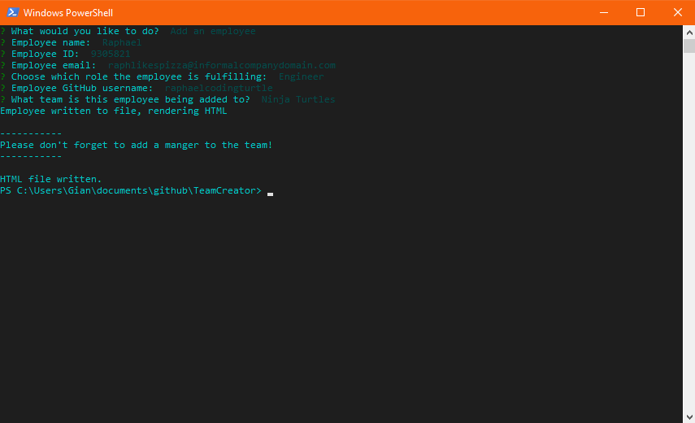
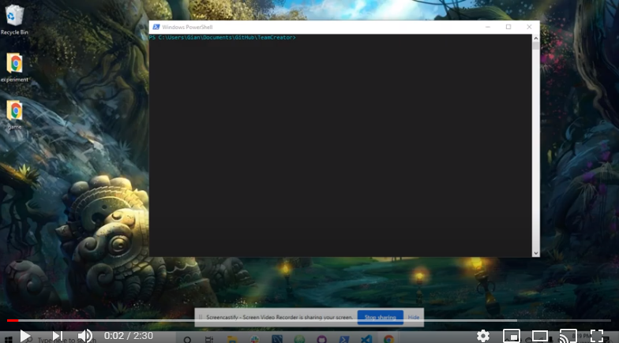

# Team Creator

https://github.com/rebgrasshopper/TeamCreator

Table Of Contents:

- [Section 1: Introduction](#introduction)
- [Section 2: Installation](#installation)
- [Section 3: Usage](#usage)
- [Section 4: License](#license)
- [Section 5: Credits](#credits)
- [Section 6: Tests](#tests)

## Introduction:

This project is a simple tool running in Node.js, designed to be able to gather information about a team consisting of managers, engineers, and interns, and display that information in an HTML page. It uses Inquirer to query the user for information, and stores employee data in an employee json file, reading it and render applicable employees to a team page. The program can add and remove employees, and re-render a page without changes. It stores all of the files generated in an output folder.

## Installation:

To install this project, download the source files from github, and access the folder via your terminal/console of choice. Run npm i to install dependancies (Inquirer), and run node index.js to start the tool.

View the walkthrough here

## Usage:

You are free to use the code for any project you wish within the limits of the GNU License. You can access it via downloading files directly from GitHub or forking the repo for your own use.

## License:

GNU General Public License v3.0

## Credits:

- [Zachary Bryan](https://github.com/zacharybryan)
- [Tim Sanders](https://github.com/tbsanders5)
- [Nick Konzen](https://github.com/NTKonzen)
- [Kira Bismuth Lowrey](https://github.com/KILowrey)
- [Nancy Lambert-Brown](https://github.com/n-lambert)
- [Mando Estrada](https://github.com/Mando619)
- [Talia Vazquez](https://github.com/taliavazquez)
- [Perry Theobald](https://github.com/perrytjr)
- [Jeneth Diestra](https://github.com/jen6one9)
- [Matthew Rogers](https://github.com/Rogers-Development-Services)
- [Jefrrey Choi](https://github.com/jepoy92)
- [Clyde Baron Rapinan](https://github.com/clydebaron2000)
- [Johnny Lieu](https://github.com/johnnylieu)
- [Robert Graham](https://github.com/Robmgraham)

## Tests:

Tests for the JavaScript classes underpinning the project's functionality are included in the /tests directory.

## Questions: 

You can contact me with questions via:
- [Email](plover.brown@gmail.com)
- [GitHub](https://www.github.com/rebgrasshopper)
- [LinkedIn](https://www.linkedin.com/in/plover-brown-37b6981a5)
